# Create VM

Users can either import an existing virtual machine or create a new one within the Create VM flow.

## Import existing VM

### Launch Create Wizard from UI

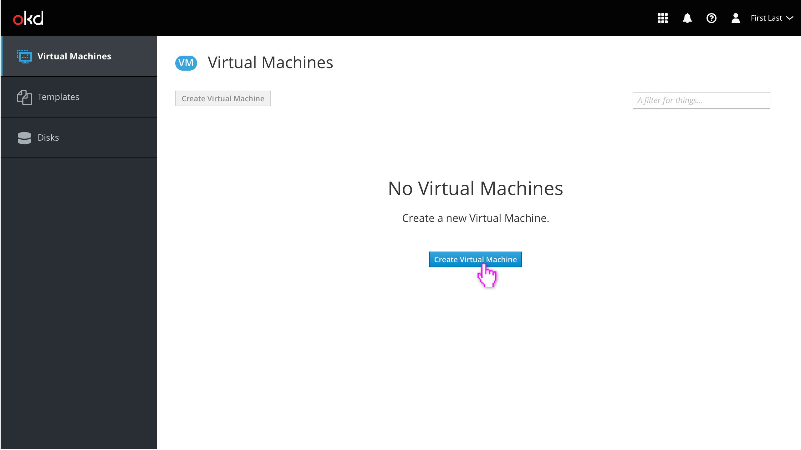

When no virtual machines exist, the Virtual Machines section of the UI will include quick access to the Create Virtual Machine wizard in its empty state.

### Select Import

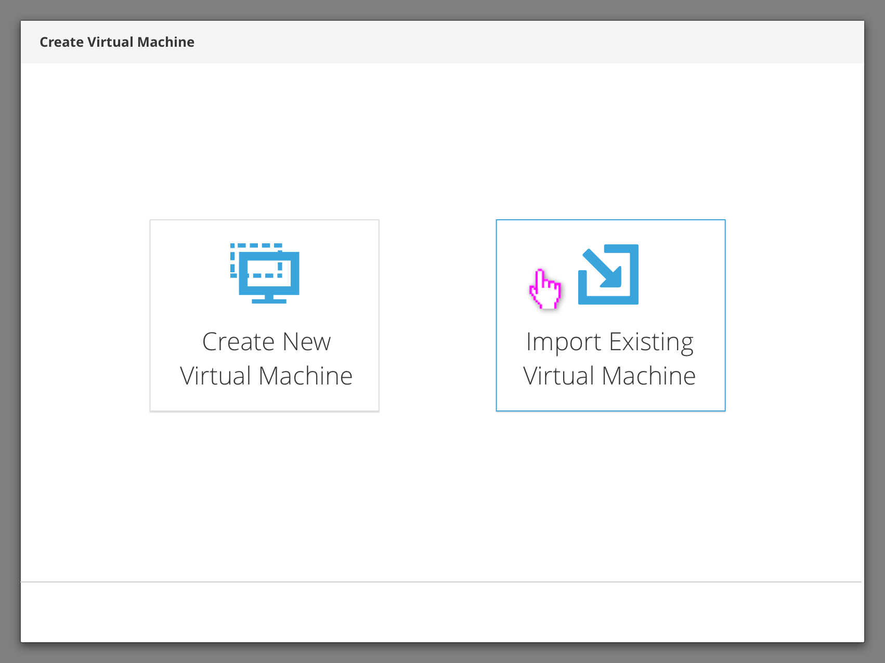

The wizard begins by asking the user whether they'd like to create or import a virtual machine.

### Import VM Wizard - Basic Information

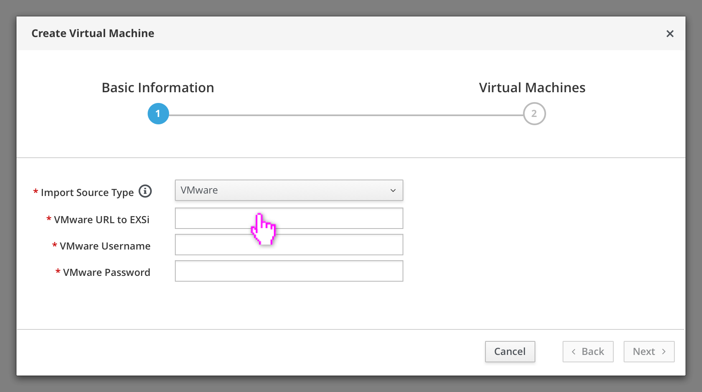

The user first needs to provide the Source of the Import. Based on this selection, the fields below may change.

After providing a URL and credentials, the user can move on to the next step where a list of importable VMs will be displayed.

### Import VM Wizard - Virtual Machines Selection

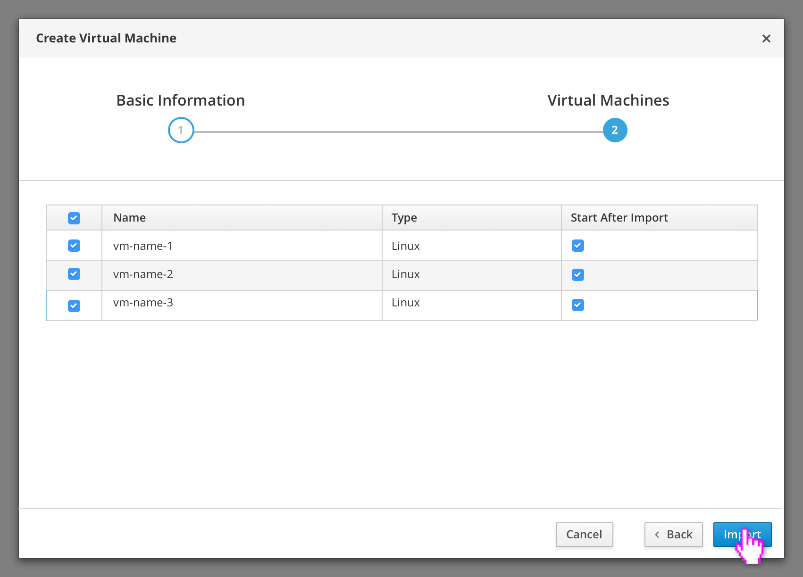

The user can select which VMs to import and optionally start them automatically after import. Clicking `Import` will kick off the process.

### VM Import Notification

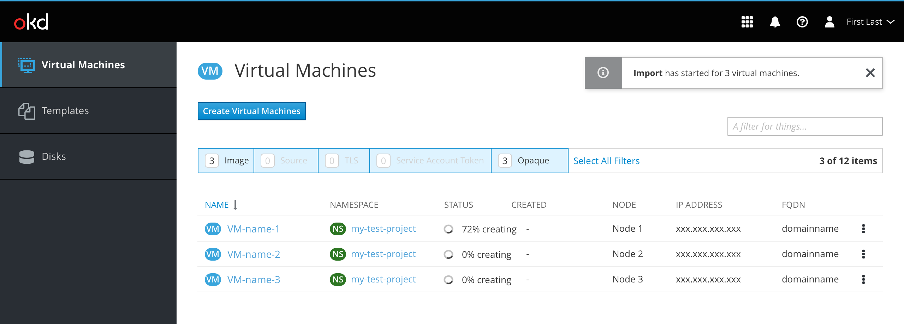

The user will be taken back to the Virtual Machines list view where they will see a toast notification along with the newly-imported VMs. Progress of each import will be shown in the list.

## Create new VM

### Select Create New Virtual Machine

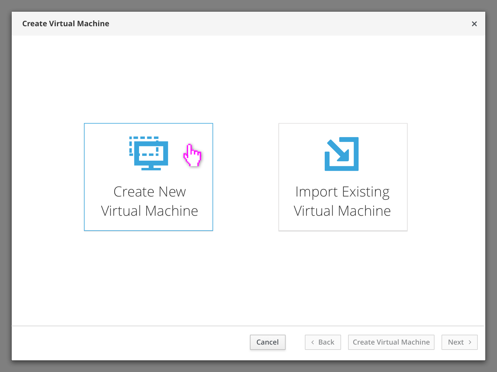

Rather than importing, the user could choose to create a new virtual machine.

### New VM Wizard - Basic Settings

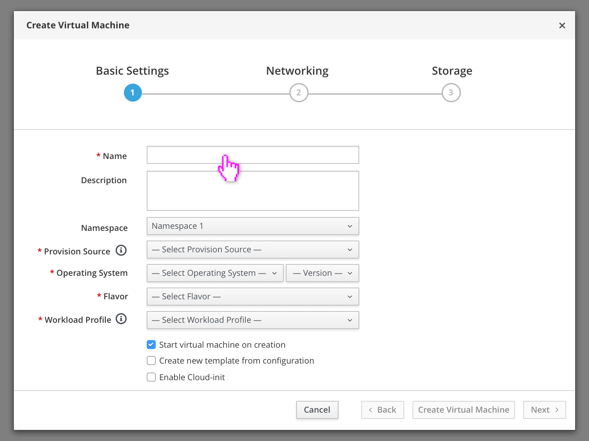

The first step surfaces basic settings. Actions to proceed are only available after the user fills out all required fields.

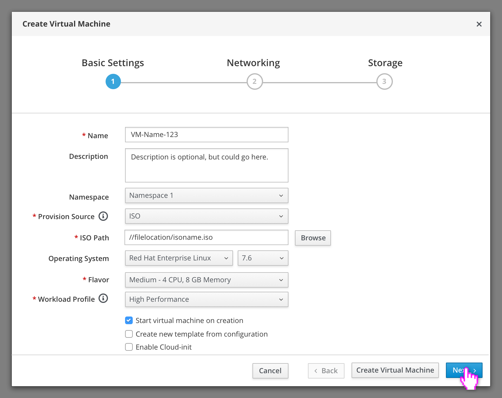

If the user selects `ISO` as the Provision Source, an additional ISO Path field will be displayed. The Operating System may be able to be pulled from the image selected, but in any case, the user can choose one from the dropdown.

After the required fields have been filled, the user can click `Create Virtual Machine` right away or continue to the next step to define Network resources.

If the user chooses `Template` as the Provision Source, a Template field will appear. Choosing a template will fill in the remaining fields with values defined by the template and disable editing of the the Operating System and Workload Profile fields. The Flavor field is still editable, but can only be either the template-defined value or `Custom`.

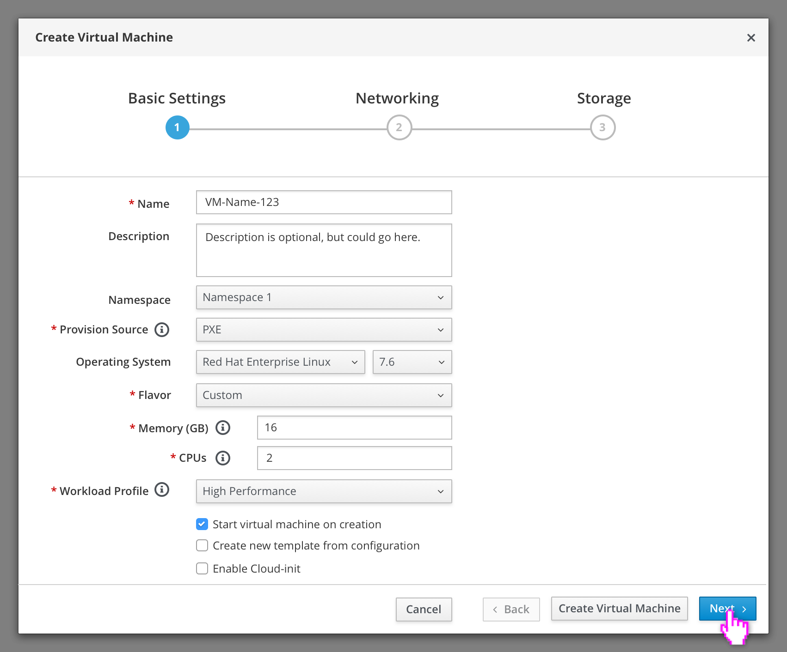

If the user chooses `PXE` as the Provision Source, this will depend on DHCP to find the PXE Server on the Network. It should be made clear in the Networking configuration step that PXE will require an L2 network.

If the user chooses to define a `Custom` Flavor, they will be able to adjust the allocated Memory and CPU.

The user can choose from a list of preset Workload Profiles. Workload Profiles and Flavors will make use of the tooltip pattern to give the user a better idea of what each option provides.

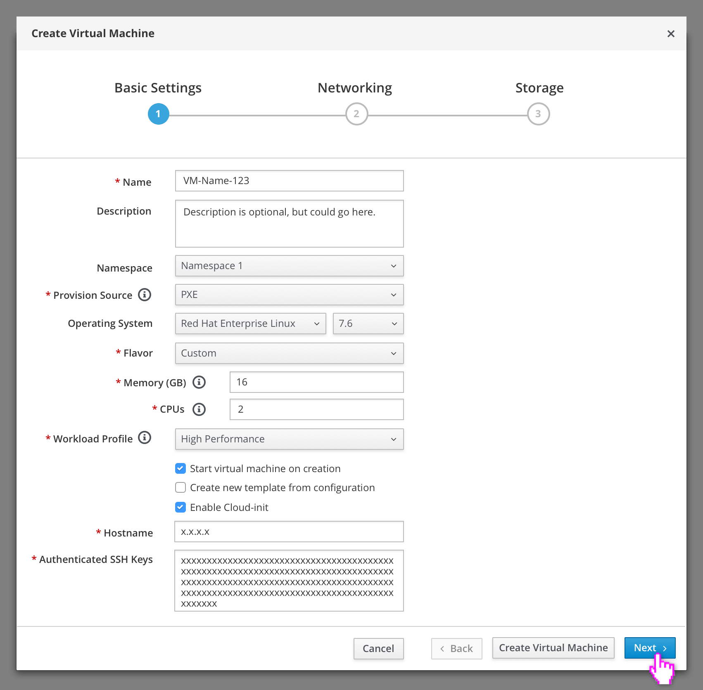

Enabling Cloud-init allows the user to define a hostname and authenticated SSH Keys to pull an additional set of configuration settings for the VM.

Once the required fields have been filled, the user can click `Create Virtual Machine` right away or continue to the next step to define Network resources.

### New VM Wizard - Networking

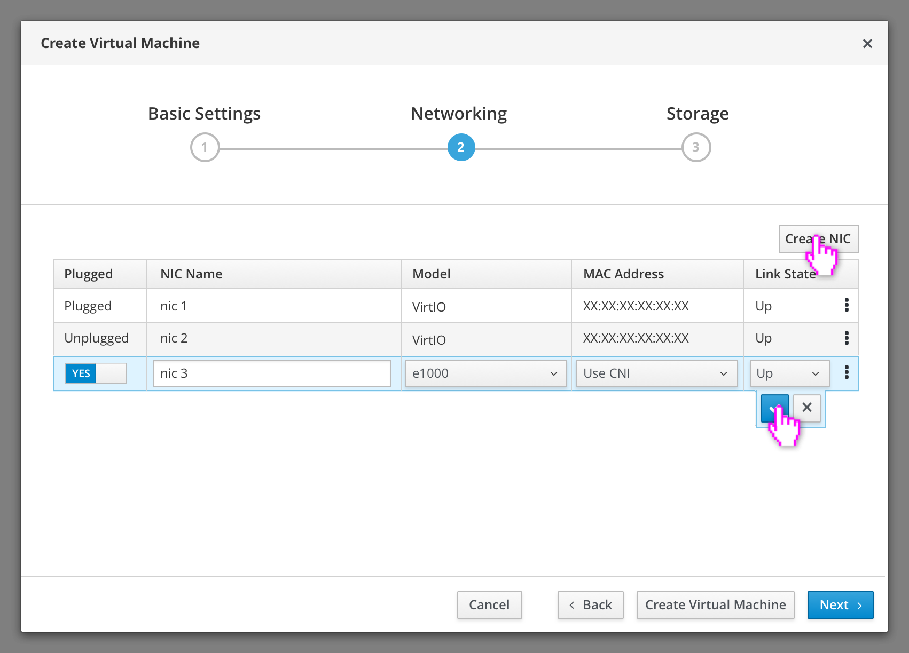

Users can create new NICs or choose from any existing NICs that have already been created. If there are NICs that have been defined by default, the user can delete them here as well.

Once the user has defined the Networking configuration, they can move to the Storage configuration step.

### New VM Wizard - Storage

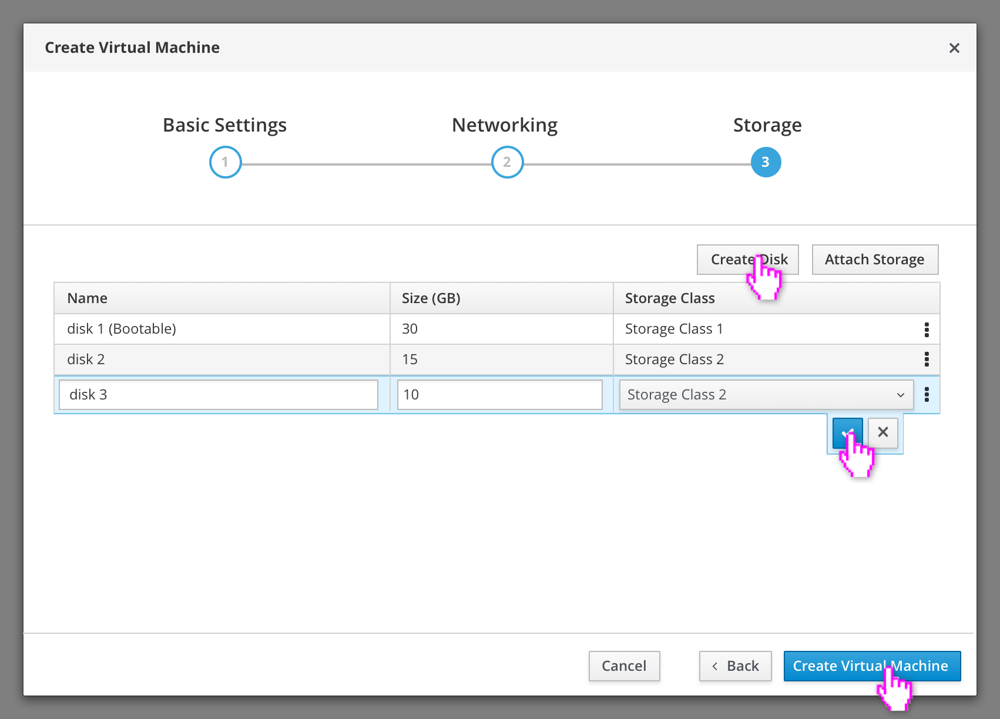

Just like NICs, the user can create new Disks or select existing Disks from the table to use for this VM.

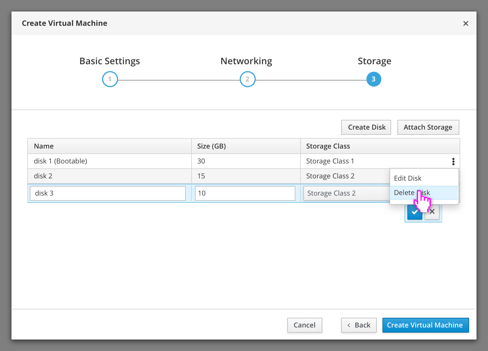

The user will have the option to edit or delete disks from the list via the kebab menu.

The user can click the `Attach Storage` button to attach existing storage. Existing storage would display the size and storage class that they're based on.

Storage is the last step in the wizard, so the primary action becomes `Create Virtual Machine`.

### VM Creation Notification

After clicking `Create Virtual Machine` the user will be taken back to the Virtual Machines list with their newly-created virtual machine included. A toast notification along will note that the virtual machine is being created, and the VM's creation progress will be displayed within its status.